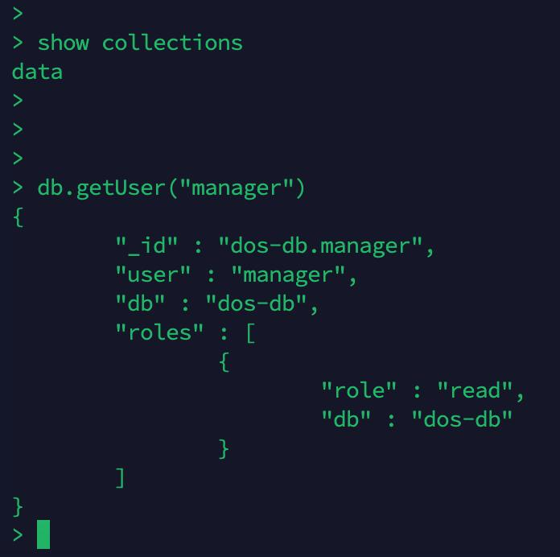
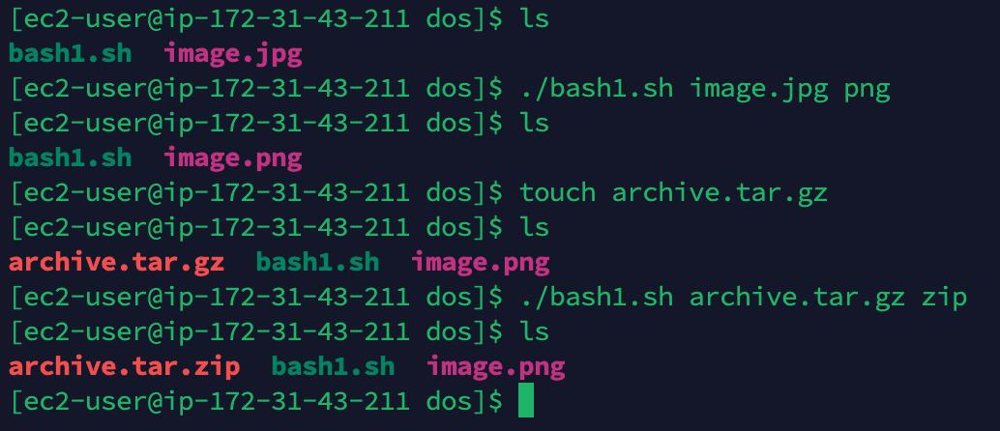
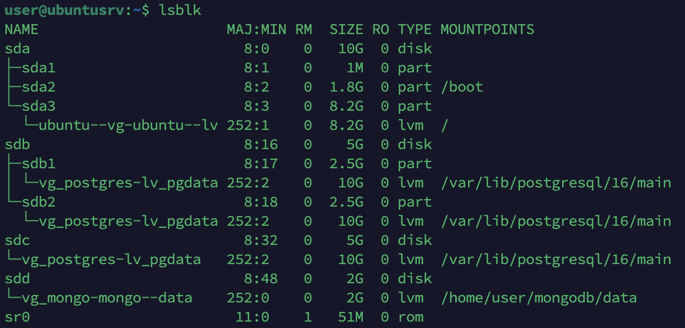
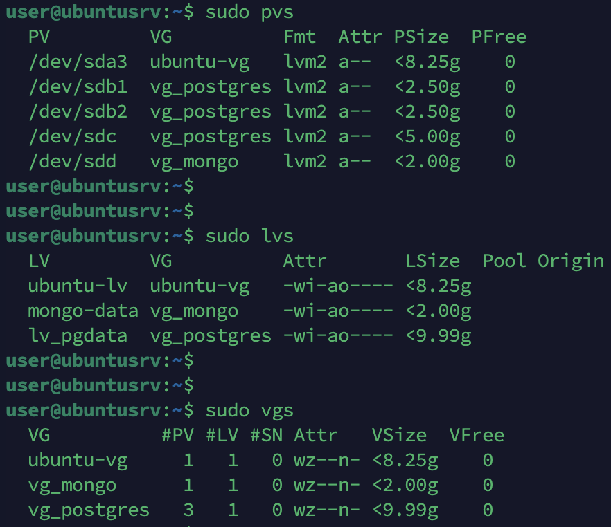
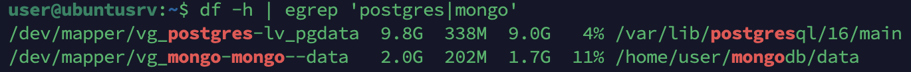
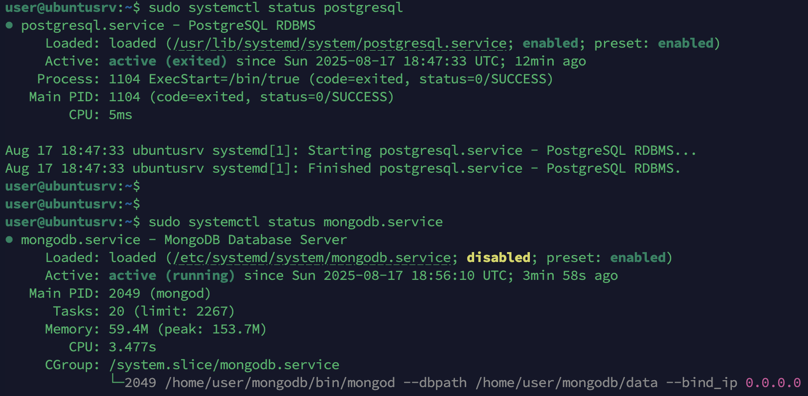

## Задание 3 – написать Bash-скрипт в соответствии с требованиями:
Содержание скрипта: замена существующего расширения в имени файла на заданное. Исходное имя файла и новое  асширение передаются скрипту в качестве параметров. Основное средство: нестандартное раскрытие переменных. Усложнение: предусмотреть штатную реакцию на отсутствие расширения в исходном имени файла.

```
#!/usr/bin/env bash

file=$1
newext=$2

if [[ "$file" != *.* ]]; then
  echo "Ошибка"
  exit 1
fi

newname="${file%.*}.$newext"

mv "$file" "$newname"
```




## Задание 4 – написать Bash-скрипт в соответствии с требованиями:
Содержание скрипта: выделение из исходной  троки подстроки с границами, заданными порядковыми номерами символов в исходной строке. Усложнение: предусмотреть возможность не выделения, а удаления подстроки. Основные средства: команда cut, переменные болочки.

```
#!/bin/bash

echo "Enter the string"
input="$1"
echo "Enter first char"
start="$2"
echo "Enter last char"
end="$3"
echo "Choose the mode: extract/delete"
mode="$4"

if [ "$mode" = "extract" ]; then
    echo "$input" | cut -c "$start"-"$end"
elif [ "$mode" = "delete" ]; then
    echo "$input" | cut -c "$start"-"$end" --complement
else
    echo "Incorrect mode: $modeg
    exit 1
fi
```




# Задание 1&2 дополнительные

## Список всех дисков и разделов


## LVM


## Файловая система


## Статус сервисов
