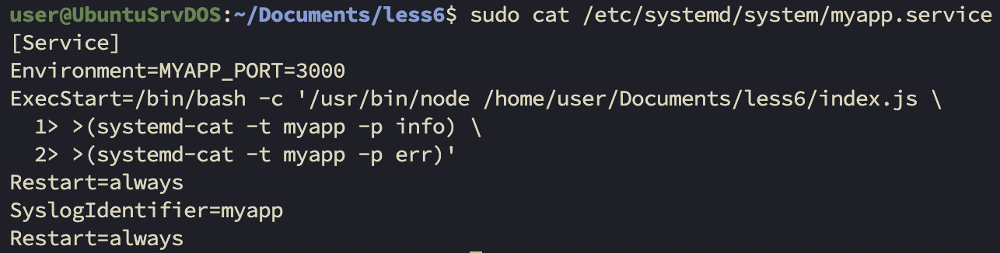
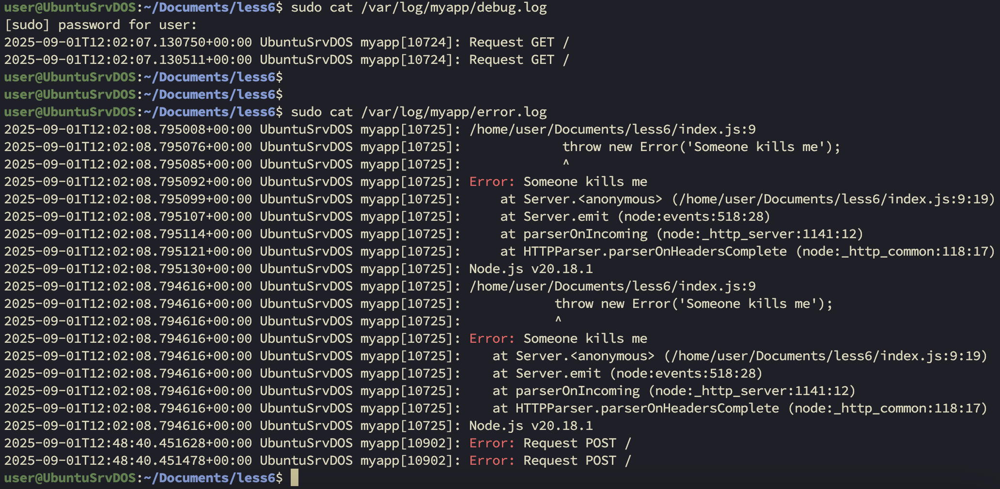

# Задание 1


```
0 16 1 * * sudo apt clean
```


# Задание 2


При записи логов в syslog:
```
StandardOutput=syslog
StandardError=syslog
```
я получал ошибку об использовании "устаревшего" метода ```Standard output type syslog is obsolete, automatically updating to journal.```.

По этому пришлось переделать "приложение", под работу с journald и приоритизацию с помощью system-cat:


---

## Конфиг rsyslog:


---

## Логи, разделенные по файлам:

