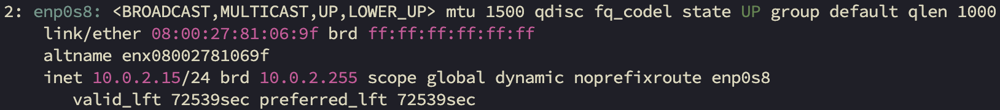
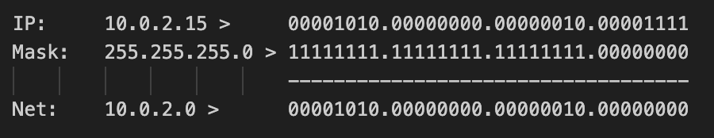
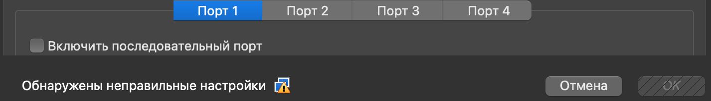

# Задание 1
## Задача 1

| Дано:                         |                  |
|-------------------------------|------------------|
| IP-адрес узла:                | 192.168.200.139 |
| Исходная маска подсети:       | 255.255.255.0   |
| Новая маска подсети:          | 255.255.255.224 |

| Найти:                        |                  |
|-------------------------------|------------------|
| Количество бит подсети        | 3                |
| Количество созданных подсетей | 8                |
| Количество бит узлов в подсети| 5                |
| Количество узлов в подсети    | 30               |
| Сетевой адрес этой подсети    | 192.168.200.128  |
| IPv4-адрес первого узла       | 192.168.200.129  |
| IPv4-адрес последнего узла    | 192.168.200.158  |
| Широковещательный IPv4-адрес  | 192.168.200.159  |

---

## Задача 2

| Дано:                         |                  |
|-------------------------------|------------------|
| IP-адрес узла:                | 192.135.250.180 |
| Исходная маска подсети:       | 255.255.255.0   |
| Новая маска подсети:          | 255.255.255.248 |

| Найти:                        |                  |
|-------------------------------|------------------|
| Количество бит подсети        | 5                |
| Количество созданных подсетей | 32               |
| Количество бит узлов в подсети| 3                |
| Количество узлов в подсети    | 6                |
| Сетевой адрес этой подсети    | 192.135.250.176  |
| IPv4-адрес первого узла       | 192.135.250.177  |
| IPv4-адрес последнего узла    | 192.135.250.182  |
| Широковещательный IPv4-адрес  | 192.135.250.183  |

---

# Задание 2

IP: 10.0.2.15
Маска подсети: 24
Класс: А





---

# Доп. задания:

## Задание 1

Нет возможности выполнить задание, т.к. на маке с arm архитектурой не удается добавить вторым адапретом, при включении VM получаю ошибку:
```
Failed to open/create the internal network 'intnet' (VERR_INVALID_STATE).
Failed to attach the network LUN (VERR_INVALID_STATE).
Код ошибки:
NS_ERROR_FAILURE (0x80004005)
Компонент:
ConsoleWrap
Интерфейс:
IConsole {6ac83d89-6ee7-4e33-8ae6-b257b2e81be8}
```
Использовать как аналог Виртуальный сетевой адаптер нет возможности, т.к. он устарел и не поддерживается:


## Задание 2

Я не делал ¯\_(ツ)_/¯ (но сделаю)